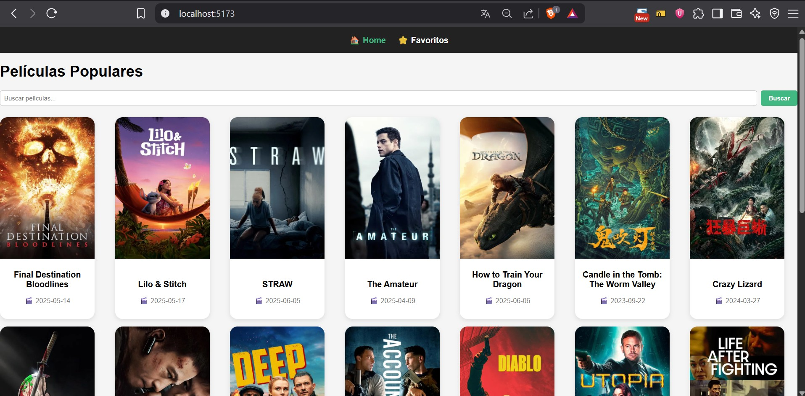
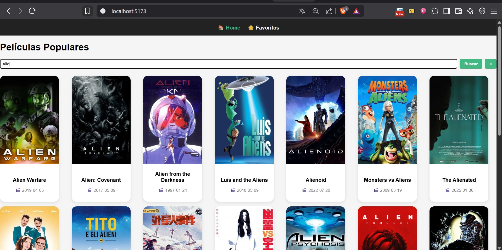
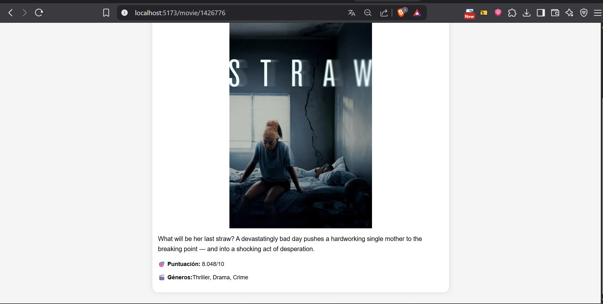
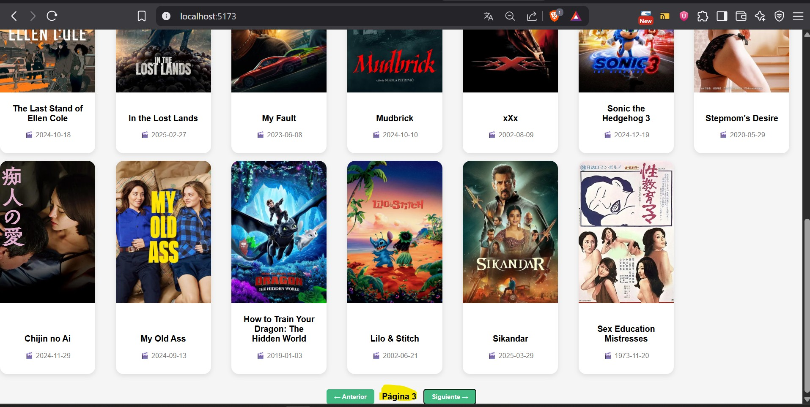
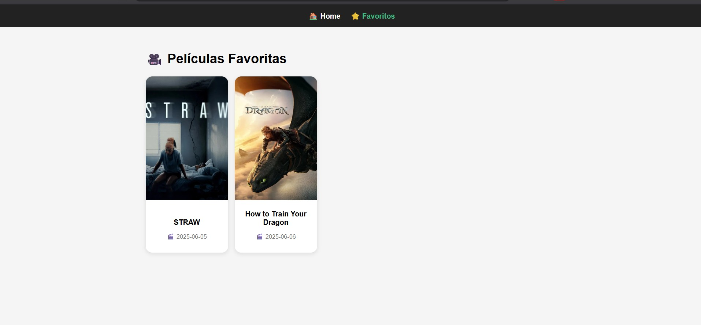

#  MovieDB Explorer – Prueba Técnica Frontend (Vue.js) Neftali Mendoza Benitez

Este proyecto es una prueba técnica para el puesto de Desarrollador Frontend en Abank.  
Se trata de una SPA (Single Page Application) desarrollada con **Vue 3**, que permite explorar un catálogo de películas mediante la API pública de [The Movie Database (TMDb)](https://developer.themoviedb.org/docs).

---

##  Funcionalidades principales

- 🔍 **Buscar películas** por nombre con resultados dinámicos.
- 🏆 **Películas populares** al cargar la aplicación.
- 📄 **Vista de detalle** con póster, descripción, géneros y puntuación.
- ⭐ **Sistema de favoritos** con persistencia usando `localStorage`.
- 📱 **Diseño responsive** para desktop y mobile.
- 🔁 **Paginación** tanto en búsqueda como en la lista principal.

---

## Tecnologías utilizadas

- [Vue 3](https://vuejs.org/)
- [Vite](https://vitejs.dev/)
- [Pinia](https://pinia.vuejs.org/)
- [Vue Router](https://router.vuejs.org/)
- [Axios](https://axios-http.com/)
- [SCSS](https://sass-lang.com/)
- API: [The Movie Database](https://developer.themoviedb.org/)

---

## 📦 Instalación del proyecto

# Clona el repositorio y ejecuta el siguiente comando para instalar las dependencias:
npm install

# Ejecución en entorno de desarrollo
npm run dev

# La aplicación estará disponible por defecto en:
http://localhost:5173/

# Estructura del proyecto
src/
├── assets/         # Estilos y recursos
├── components/     # Componentes reutilizables (MovieCard, NavBar)
├── composables/    # Lógica reutilizable (useMovies)
├── router/         # Configuración de rutas
├── services/       # Conexión a API con Axios
├── store/          # Pinia Store para favoritos
├── views/          # Vistas: Home, MovieDetail, Favorites
├── App.vue
└── main.js

# Estado del proyecto
Prueba completada con todos los requisitos funcionales y técnicos implementados.
Diseñada para ser clara, escalable y enfocada en buenas prácticas.

# Nota sobre la API Key
Se utilizó la API Key proporcionada en la prueba. Si el proyecto no carga datos, asegúrate de que la API siga activa o revisa los permisos de red.

##  Capturas de pantalla

###  Home (Películas populares)

###  Resultado de buscar

###  Detalle de películas

###  Paginacion

###  Favoritos

